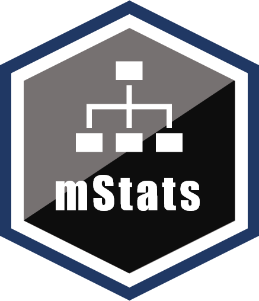

<!-- README.md is generated from README.Rmd. Please edit that file -->


# mStats <a href='https://myominnoo.github.io'></a>

<!-- badges: start -->

[](https://cran.r-project.org/package=mStats)
[](https://github.com/tidyverse/dplyr/actions?workflow=R-CMD-check)
[](https://codecov.io/gh/myominnoo/mStats?branch=master)
[](https://cran.r-project.org/package=mStats)
<!-- badges: end -->

## Overview

The `mStats` is a R package that provides tools for epidemiological and statistical data analysis. There are four major groups of functions: 

  - `data management` - cleans, processes and manages your
    dataset.
  - `statistical analysis` - produces well-formatted outputs of
    common statistical procedures.
  - `epidemiological calculation` - integrates such calculations into
    your pipeline of analysis.
  - `helpers` - support the remaining functions in their calculation and output as well as streamline the process of transferring results for manuscript writing. 

### History

The package `mStats` came into life when I started my Ph.D. in 2018. Its first version was released on GitHub in late 2018. Initially, it was intended for fun and I wanted to know how much I could make use of what I have learned R so far. Also, I would like to create something different which may not be entirely innovative since there are lots of good R packages out there.

Two main packages deeply inspired me, `tidyverse` and `epicalc`. In the first version of `mStats`, I created some functions to make plots based on `ggplot2`. I updated several small patch versions adding a few more functions that were interesting to me at that time. In mid-2019, I started another package called `stats2` where I tried to simplify the concept that one function should do a task without too many options. For example, the `tab` function should perform the task of tabulation with a few options to tweak its outputs. That's the whole idea of the package. I felt that beginners do not mind having only a few options to do so. They do not use as much as advanced users do. 

I continued developing the package with feedback from teachers, friends, and colleagues. In early 2020, I submitted to `CRAN` and published version 3.2.2 a month later on March 31, 2020. As times progress, I hope this package will at least provide some contributions in some people. Any constructive criticism, suggestions, or comments are most welcome. For detail, visit my website. [https://myominnoo.github.io/](https://myominnoo.github.io/)

### Concepts
The `mStats` comes with the following concepts.   

1) `data` as the first input

During analysis, it is common to use a dataset, either imported from an external source or created. R functions are usually very generic and created for basic data structures of R. Hence, to use variables from a dataset, there are two general ways: 1) use the  `attach` function and use the names of variables directly, and 2) to subset data using dollar sign `$` or square brackets `[]` to provide integer positions of desired variables. To avoid this, functions in `mStats` need dataset as its first input. It also helps to remember the dataset you are working with. After all, words are easier to write and comprehend than complex characters and symbols.  


2) Keep `functions` short and simple. 

All functions in `mStats` are straight-forward. Each function works one task with only a handful of optional arguments to change its nature of the output.  
<br><br><br><br>
    
As an instance, the function `tab` simplifies the process of frequency tabulation for a single variable, and cross-tabulation if `by` input is specified. It provides only three additional inputs, `row.pct`, `na.rm` and `rnd`, to change the nature of percentages, missing values, and decimal points. However, even these three input options are used scarcely.

3) Labels

It maintains the concept of labeling variables and dataset. However, labeling at value level is deemed as unnecessary in R. This can be done though, using `forcats` package. 

4) Well-formatted outputs  

Functions for data analysis produces well-formatted outputs. This helps the readability and comprehensibility of the users as well as further processing for manuscript writing. 

5) Messages for users

Notification is important. Functions in `mStats` provide a message of what has been done to the dataset. For example, `generate` function is used to create a new variable. The message indicates how many real (`valid`) values are generated. If any `missing` values are detected, the message also includes how many `missing` values are produced. This is an important part of communication between R, `mStats`, and the users.

## Installation

``` r
# The easiest way to get mStats is from CRAN:
install.packages("mStats")
```

### Development version

To get a bug fix or to use a feature from the development version, you
can install the development version of `mStats` from GitHub.

``` r
# install.packages("devtools")
devtools::install_github("myominnoo/mStats")
```

## Masking

The `mStats`package contains two functions (`append`, `replace`) that have the same names (doing different operation) with base R packages (`stats` and `base`). Loading the `mStats` masks the functions from base R. It means that when you use `append` function, you are using the function from `mStats`. To avoid this: 

* use the syntax `package::function()`, for example `base::append()` or `mStats::append()`.
* remove `mStats` from the session using `detach(package:mStats)`.


## Usage 


## Getting help

If you encounter a clear bug, please file an issue with a minimal
reproducible example on
[GitHub](https://github.com/myominnoo/mStats/issues). For questions and
other discussion, please email me view
[dr.myominnoo@gmail.com](mailto::dr.myominnoo@gmail.com).

-----

Please note that this project is looking for contributors. By
participating in this project, you agree to abide by its terms with
[Contributor Code of
Conduct](https://www.contributor-covenant.org/version/1/0/0/code-of-conduct/),
version 1.0.0, available at
<https://www.contributor-covenant.org/version/1/0/0/code-of-conduct/>.
