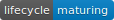

<!-- README.md is generated from README.Rmd. Please edit that file -->

```{r, include = TRUE, echo = FALSE}
knitr::opts_chunk$set(
  collapse = TRUE,
  warning = FALSE,
  comment = "#>",
  fig.path = "man/figures/README-",
  out.width = "100%"
)
```

# mStats 

<!-- badges: start -->

[](https://cran.r-project.org/package=mStats)
[](https://cran.r-project.org/package=mStats)
[](https://www.tidyverse.org/lifecycle/#maturing)

<!-- badges: end -->

mStats is a open-source R package to facilitate data management, analysis 
and report writing with a focus on health research. It allows to manipulate
data, run statistical analysis, and calculate common epidemiological measures. 
Their outputs, in turn, can be further processed by highly sensible functions
to produce publication-ready tables. 
  
In a nutshell, mStats is designed to make data analysis practical, quick and 
easy for health researchers to create the final report in time. 
You can see it in action to [Get Started](https://mmoo.netlify.app/r/mStats/).

## Installation

You can install the released version of mStats from [CRAN](https://CRAN.R-project.org) with:

``` r
install.packages("mStats")
```

### Development version 

If you want to use the development version of the bookdown package, you can install the package from GitHub via the {remotes package}(https://remotes.r-lib.org/):

``` r
remotes::install_github("myominnoo/mStats")
```


## Cheat Sheet

[to add later]

## Masking

The `mStats`package contains two functions (`append`, `replace`) that have the same names (doing different operation) with base R packages (`stats` and `base`). Loading the `mStats` masks the functions from base R. It means that when you use `append` function, you are using the function from `mStats`. To avoid this: 

* use the syntax `package::function()`, for example `base::append()` or `mStats::append()`.
* remove `mStats` from the session using `detach(package:mStats)`.

## Usage

The easiest way to get started with mStats is to follow the guide [here](https://myominnoo.github.io/mStats/). Below is a quick demonstration of what mStats can do. 

```{r demo1}
## to use pipe %>% for expression of sequential operations 
## Hence, no need to provide `data` argument in subsequent operations
library(magrittr) 

library(mStats)

## Describe dataset 
iris %>% 
  codebook

## Label variables and dataset
## new object is assigned to make the changes permanent
iris_re <- iris %>% 
  label("Edgar Anderson's Iris Data") %>% 
  label(Sepal.Length = "Length of Sepal",
        Petal.Length = "Length of Petal",
        Species = "Type of species") %>% 
  codebook 

```


## Getting help

If you encounter a clear bug, please file an issue with a minimal
reproducible example on
[GitHub](https://github.com/myominnoo/mStats/issues). For questions and
other discussion, please directly email me [dr.myominnoo@gmail.com](mailto::dr.myominnoo@gmail.com) or use the [mStats mailing list](https://groups.google.com/g/mstats).


-----

Please note that this project is looking for contributors. By
participating in this project, you agree to abide by its terms with
[Contributor Code of
Conduct](https://www.contributor-covenant.org/version/1/0/0/code-of-conduct/),
version 1.0.0, available at
<https://www.contributor-covenant.org/version/1/0/0/code-of-conduct/>.
