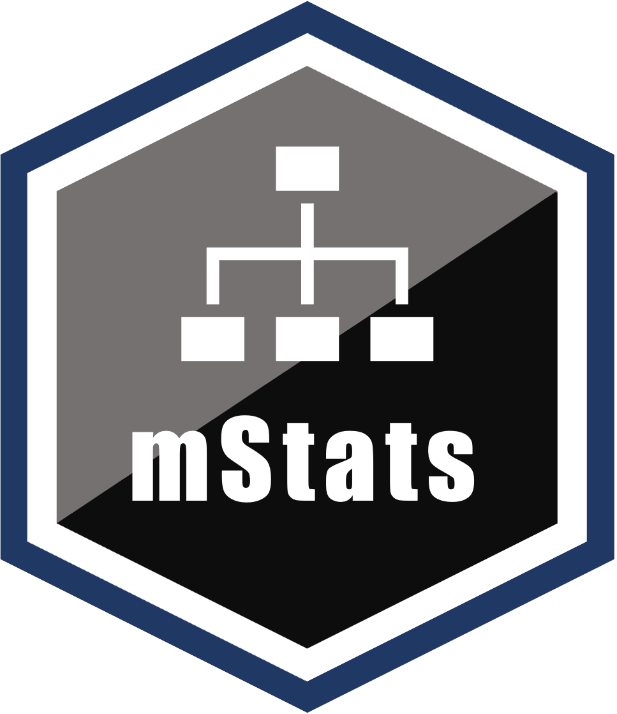

<!-- README.md is generated from README.Rmd. Please edit that file -->

# mStats <a href='https://myominnoo.github.io/mStats'></a>

<!-- badges: start -->

[](https://CRAN.R-project.org/package=mStats)
[](https://github.com/myominnoo/mStats/actions/workflows/R-CMD-check.yaml)
[](https://app.codecov.io/gh/myominnoo/mStats?branch=main)
[](https://lifecycle.r-lib.org/articles/stages.html#stable)
<!-- badges: end -->

`mStats` provides an opinionated set of R wrapper functions for data
analysis and manipulation, covering a range of tasks from data
exploration and transformation to regression modeling and statistical
summaries. It serves as my personal collection of functions developed
based on my own preferences and experiences, tailored to meet my
specific needs in various projects.

As an evolving package, I continuously add new functions to `mStats` to
adapt to my evolving needs and preferences. This highly opinionated
package reflects my unique perspective and incorporates the solutions I
have found valuable in my data analysis workflows.

By using `mStats`, users can benefit from my expertise and the
convenience of having a centralized set of functions designed to address
common data manipulation, analysis, and visualization tasks. This
personalized approach ensures efficiency and consistency across
projects, as the package encompasses the techniques I prefer.

I believe that `mStats` makes a valuable contribution to the R community
by offering insights and potential solutions derived from my own
experiences. It showcases the power of customization and demonstrates
how individual preferences can shape the development of tools to enhance
data analysis workflows.

## Installation

Install from CRAN with :

``` r
install.packages("mStats")
```

Or install the development version from GitHub :

``` r
# install.packages("devtools")
devtools::install_github("myominnoo/mStats")
```

## Usage

Below is a quick demonstration of what mStats can do.

``` r
library(mStats)
#> 
#> Attaching package: 'mStats'
#> The following objects are masked from 'package:base':
#> 
#>     append, cut
```

### codebook: check an overview of the data

``` r
codebook(mtcars)
#> $ Codebook
#>   dataset: mtcars
#>   Row: 32
#>   Col: 11
#>    name type  miss complete unique label
#> 1  mpg  <dbl> 0    1.00     25          
#> 2  cyl  <dbl> 0    1.00      3          
#> 3  disp <dbl> 0    1.00     27          
#> 4  hp   <dbl> 0    1.00     22          
#> 5  drat <dbl> 0    1.00     22          
#> 6  wt   <dbl> 0    1.00     29          
#> 7  qsec <dbl> 0    1.00     30          
#> 8  vs   <dbl> 0    1.00      2          
#> 9  am   <dbl> 0    1.00      2          
#> 10 gear <dbl> 0    1.00      3          
#> 11 carb <dbl> 0    1.00      6
```

### cut
